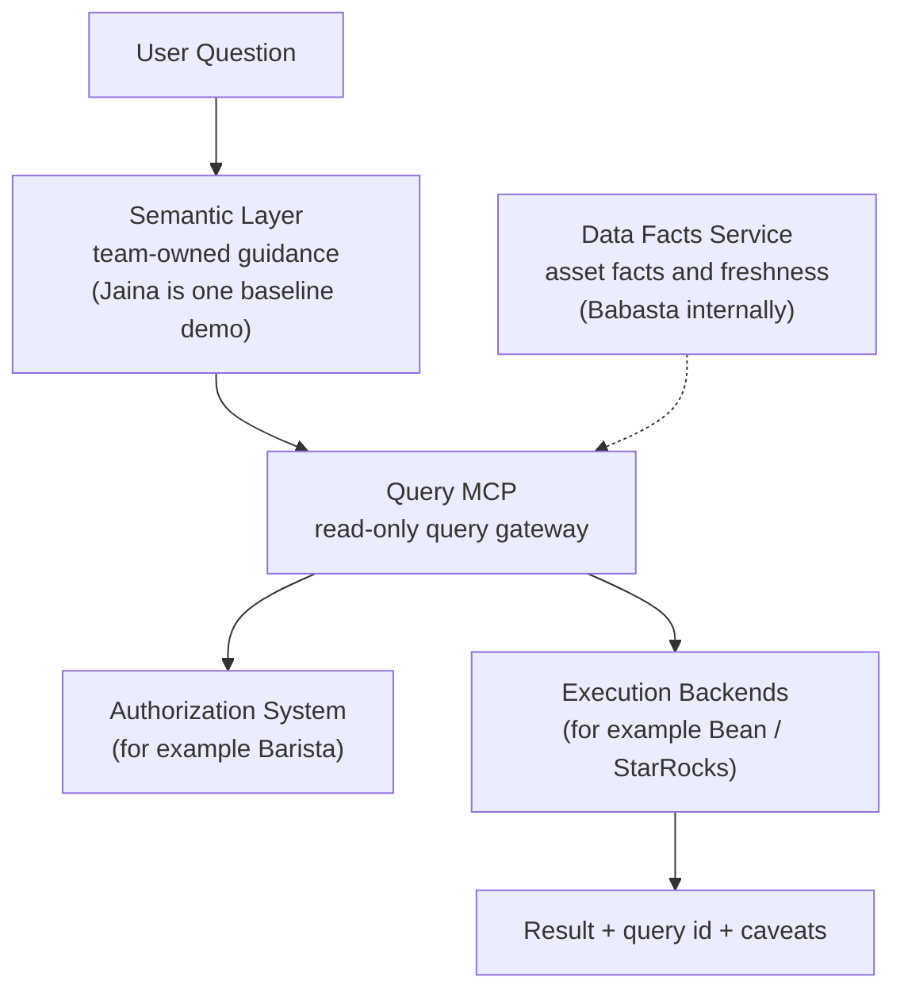
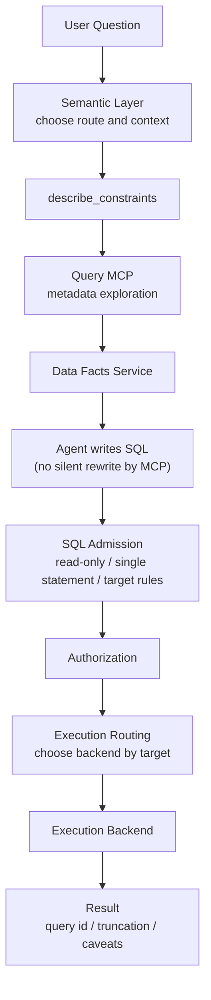

# Agent Harness：如何设计 AI Query 架构

## Abstract

LLM 让自然语言访问数据系统变得更可行。用户不再需要记住每个存储介质的 SQL dialect、连接方式、catalog 名称和查询约束，而是可以描述自己的意图，让 Agent 针对不同数据源生成对应的 SQL。

但在真实数据环境里，AI Query 不只是 Text-to-SQL。它还会遇到权限、安全、资源、数据事实、业务语义和审计等问题。我们的阶段性实践是构建一套 Agent Harness：用 Query MCP 收敛安全查询入口，用 Data Facts Service 提供机器可读的数据资产事实，再允许各团队在其上构建自己的语义层。

本文讨论的是这个架构思路，而不是某个必须复用的内部项目实现。我们内部目前有一些对应实现，但这些名字只是帮助理解角色边界，并不是理解本文的前提。

## 术语说明

为了避免读者必须了解内部代码，先说明本文中的几个角色：

- **Query MCP**：面向 Agent 的只读查询网关，负责 SQL 准入、鉴权编排、执行路由、资源限制、并发控制和审计日志。我们内部当前实现对应 mcp-server-starrocks。
- **Data Facts Service**：数据资产事实服务，提供表 owner、描述、分区字段、新鲜度、policy version 等机器可读信息。我们内部当前实现叫 Babasta。
- **Semantic Layer**：团队维护的语义层，用来帮助 Agent 把用户问题映射到数据源、指标口径、SQL 写法和 caveat。我们内部有一个基于 semantic docs 的 baseline demo，叫 Jaina。
- **Authorization / Execution Backends**：已有的数据平台能力，例如权限系统、任务执行服务和底层查询引擎。

这些名字只是当前实现。更重要的是它们背后的职责分离。

## 1. 为什么 AI Query 值得重新设计

AI Query 看起来像是一个简单流程：用户提问，LLM 写 SQL，系统执行。但落到真实数据平台，会遇到更复杂的问题。

首先，底层存储往往是分散的。不同数据可能在 OLAP、Hive、外部 catalog 或其他系统里。不同介质的表命名方式、SQL dialect、执行入口和性能特征并不一致。过去用户需要知道：

- 这张表在哪个系统里
- 应该走哪个 catalog
- 表名应该写成 db.table 还是 catalog.db.table
- 哪些查询必须加分区过滤
- 哪些系统适合聚合，哪些只适合抽样
- 哪些 SQL 语法在当前介质里可用

LLM 的出现提供了新的希望：用户可以用自然语言表达问题，由 Agent 根据目标存储介质生成对应 dialect 的 SQL。也就是说，我们不一定要强行把所有存储系统伪装成同一个数据库，而是可以让 LLM 在正确上下文里写出适合目标介质的查询。

但这并不意味着 Agent 可以直接连库。AI Query 还需要面对这些问题：

- 权限：Agent 必须继承人的权限，而不是拥有独立特权。
- 安全：DDL、DML、admin command、多语句和危险跨源查询都需要被约束。
- 资源：AI 探索式查询容易扫大表，需要限制行数、超时、内存和并发。
- 数据事实：schema 不等于语义，Agent 还需要 owner、描述、分区、新鲜度等上下文。
- 业务语义：指标定义、字段含义、选表路径通常只能由领域团队维护。
- 审计：谁查了什么、走了哪个 backend、是否 fallback、结果是否截断，都需要可追踪。

所以，AI Query 的重点不是单纯生成 SQL，而是设计一个让 Agent 安全访问数据系统的 Harness。

## 2. 设计原则

我们的设计原则比较克制。

### 2.1 统一交互，不强行统一存储

不同介质仍然保留自己的 SQL dialect 和约束。架构要做的是把这些差异显式暴露给 Agent，例如通过 engine/catalog 和 describe_constraints 告诉 Agent 当前 target 的命名规则、查询限制和执行特征。

LLM 负责在上下文里生成适合目标介质的 SQL。Query MCP 负责告诉 LLM 边界，并在服务端强制执行这些边界。

### 2.2 安全边界必须服务端强制

prompt、skill、文档都可以指导 Agent，但不能作为真正的安全边界。只读、鉴权、资源预算、并发和结果截断必须在 Query MCP 服务端完成。

### 2.3 不静默改写用户 SQL，而是引导 Agent 改写

当 SQL 不满足规则时，系统应返回明确、可解释的拒绝原因，例如缺少 LIMIT、缺少分区过滤、catalog 不匹配或命中权限规则。

Query MCP 不应该在用户不知情的情况下自动补过滤条件、替换表、放宽或收紧查询范围，也不应该偷偷改变业务逻辑。正确做法是让 Agent 基于错误信息和约束说明重新生成 SQL，并把改写意图暴露给用户。

这看起来比自动修复多一步，但可以避免"查询看起来成功，语义其实已经变了"的风险。

### 2.4 权限、事实、语义分离

权限系统负责判断用户是否可以访问资源。Data Facts Service 负责提供数据资产事实。Semantic Layer 负责业务口径和查询路径。不要把权限裁决、事实描述和业务解释混在一个黑盒 Copilot 里。

### 2.5 查询前先发现约束

Agent 应该先理解当前 target 的 SQL 规则、资源预算、权限提示和推荐流程，再生成或执行查询。一个好的 AI Query 系统不应该是"先跑再说"，而应该是"先知道边界"。

### 2.6 显式暴露不确定性

metadata 缺失、数据过期、Data Facts Service 不可用、结果截断、fallback、文档未确认，都应该成为回答中的 caveat，而不是被隐藏。

## 3. Agent Harness 架构总览

我们把 AI Query 拆成几类角色，而不是做成一个大而全的 Copilot。

这张图里，边界比名字更重要：

- Semantic Layer 帮助 Agent 选择数据域、理解口径、组织上下文、生成 SQL 和输出 caveat。
- Query MCP 是硬边界所在，负责查询准入、鉴权编排、执行路由、资源控制和审计。
- Data Facts Service 提供事实，不做权限和执行。
- 权限和执行继续复用已有数据平台能力。

## 4. Query MCP：面向 Agent 的查询网关

Query MCP 是 Agent 访问数据系统的统一入口。它的重点不是"能执行 SQL"，而是让执行过程可控、可观测、可审计。

它通常需要提供几类能力：

- 发现可用 target 和查询约束
- 查看当前身份和使用量
- 执行只读 SQL 和受支持的 metadata 语句
- 做表级或库级结构探查
- 记录 query id、fallback、截断和错误信息

一次查询的大致链路如下：

对于不同的数据源，Query MCP 可以选择不同执行路径。例如某些明细类查询可以走任务执行服务，某些 OLAP 查询可以直连查询引擎。关键是这些差异通过 target 约束暴露给 Agent，并由服务端做最终校验，而不是完全依赖 Agent 自觉。

## 5. Data Facts Service：面向 Agent 的数据资产事实

Query MCP 解决的是"能不能安全查"，Data Facts Service 解决的是"Agent 查之前能不能更理解这张表"。

一个 Data Facts Service 可以提供：

- 表 owner
- 表描述
- 分区字段
- 分区范围、数量或其他统计事实
- 数据来源
- 更新时间
- policy version
- 表级查询策略描述

这些信息对 Agent 很重要。因为 Agent 不只需要字段名和类型，还需要知道：

- 这张表大概描述什么业务对象
- 谁维护这张表
- 应该优先用哪个时间或分区字段过滤
- 数据是否可能过期
- 当前事实来自哪个版本

需要强调的是，Data Facts Service 不是权限系统，也不是 SQL 执行系统。它不判断用户是否有权限，不解析 SQL，不重写 SQL，也不调用大模型。它只是把数据资产事实结构化，让 AI Query 的上下文更可靠。

## 6. 一个脱敏例子：从"查昨天活跃用户"到安全查询

假设用户问："帮我查昨天活跃用户。"

一个直接的 Text-to-SQL 系统可能马上生成 SQL。但在 Agent Harness 里，更合理的流程是：

1. Semantic Layer 判断这是用户活跃指标问题。
2. Agent 先调用约束发现能力，确认可用数据源、SQL 规则和资源预算。
3. 如果有已确认的汇总表，优先走报表或 OLAP 路径。
4. 如果需要明细数据，走明细存储路径，并显式带上时间或分区过滤。
5. Agent 使用结构探查能力查看候选表 schema。
6. Data Facts Service 补充 owner、分区字段、更新时间和 policy version。
7. Agent 生成只读 SQL。
8. Query MCP 做 SQL Admission 和权限校验。
9. 如果 SQL 不合规，MCP 返回拒绝原因，由 Agent 显式改写。
10. 最终回答包含 SQL、route、过滤条件、结果和 caveat。

这个流程看起来比"直接执行"多几步，但它让 Agent 的行为更可解释，也更适合真实数据环境。

## 7. 语义层：不止一种构建方式

Query MCP 和 Data Facts Service 解决的是通用基础能力，但业务语义不应该由平台统一猜测。

语义层目前仍然是一个值得持续探索的问题。我们内部的 Jaina 提供了一个简单 baseline：通过 semantic docs 收集使用规则、表说明、字段定义和查询边界，让 Agent 自底向上地理解一个数据域。

这种方式的优点是：

- Agent 探索自由度高
- 适合数据探查、临时分析和开放式问题
- 容易从现有文档开始沉淀

它的局限也很明显：

- 对模型能力要求更高
- 准确性依赖文档质量
- 当文档很多时，Agent 容易迷失在 doc 海洋里

我们也看到另一类实践：有些团队更倾向于在语义层维护 SQL 模板，从需求出发，自顶向下地定义"这个问题应该如何查"。Agent 主要负责模板选择、参数填充和结果解释。

这种方式的优点是：

- 准确性更有保障
- 对模型能力要求更低
- 更安全、可控，适合高频和口径稳定的场景

它的局限是：

- 探索自由度较低
- 覆盖新问题需要持续维护模板
- 更接近产品化问答，不一定适合开放式分析

当数据域变得很宽时，语义层可能还需要渐进展开设计。Agent 不应该一开始就被大量文档淹没，而应该先看到领域目录、指标族、表族和查询入口，再按当前问题逐层展开相关材料。

这几种方法没有绝对优劣。前者更像"给 Agent 一张地图，让它自己探索"；后者更像"给 Agent 一组可靠路径，让它按需选择"。具体采用哪种方式，应该取决于团队的数据成熟度、问题开放程度、安全要求和维护成本。

## 8. 当前边界和仍在探索的问题

这套架构还在演进中，也有一些我们认为需要持续说明的边界：

- Data Facts Service 里的策略描述不应被误解成所有查询准入都已经强制接入。
- Semantic Layer 是软指导，真正的安全边界仍然在 Query MCP 服务端。
- 语义文档的新鲜度需要团队持续维护。
- 当 metadata 来自镜像或缓存时，需要提示可能存在滞后。
- 宽数据域下的语义层 routing、retrieval 和渐进展开仍值得继续探索。

我们更倾向于把这些边界讲清楚，而不是把当前实践包装成一个已经解决所有问题的最终答案。

## Conclusion

AI Query 的核心挑战，不只是让 LLM 写 SQL，而是让 Agent 在真实数据平台里安全、准确、可治理地工作。

Agent Harness 的价值在于：统一交互入口，但保留底层存储差异；服务端强制安全边界，而不是依赖 prompt；用 Data Facts Service 提供机器可读的数据事实；用 Query MCP 承接查询准入、权限、执行和审计；再把业务语义开放给各团队构建。

这仍然是一个持续探索中的方向。Jaina 只是一个 baseline demo。我们更希望各团队基于 Query MCP 和 Data Facts Service，结合自己的数据域、指标体系和使用场景，构建不同形态的语义层，并一起沉淀更好的 AI Query 实践。
