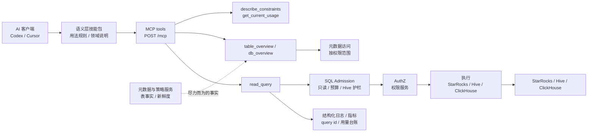

# AI 数据应用

> 端到端的 AI 数据应用：查询侧提供安全、可审计的只读数据访问，交付侧提供受治理、可追溯的数据报告发布。

## 总览

AI 数据应用由两大支柱组成，共享同一条原则——**把 AI 时代「产出更快」的能力，用平台化治理补上「安全、可审计、可追溯」这后半程**：

1. **AI 查询体系**：面向 Codex/Cursor 等 MCP 客户端的只读数据查询体系——统一查询网关负责执行与审计，元数据与策略服务提供事实元数据与查询策略，语义层技能包提供领域引导。
2. **报告交付与数据可视化**：面向 AI 编码时代的内部数据报告交付平台——分析师负责页面与指标计算，平台负责身份、权限、数据契约与可追溯发布。

---

# 第一部分 · AI 查询体系

> 设计思考另有两篇独立文章：[Agent Harness：如何设计 AI Query 架构](../agent-harness-ai-query.zh-CN.md)（架构与职责分离）、[Semantic Federation：一种组合语义层构建方式](../semantic-federation-ai-query.zh-CN.md)（语义层构建的续篇）。

## 目的与边界

这里的「AI 查询」指一组面向 Codex、Cursor 或自定义 MCP 客户端的**安全数据查询工具与使用约束**，不是一个独立实现的 Agent。工具链由三类能力组成：

- 统一查询网关：统一的只读 MCP 查询网关（基于社区版 StarRocks MCP 服务延伸而来，兼容 Hive / MySQL / ClickHouse 等多种存储）。
- 元数据与策略服务：表级事实元数据与新鲜度信息来源。
- 语义层技能包：面向 AI 客户端的领域说明、路由规则与查询护栏文档包。

职责重心并不平均分布：核心在前两层——把查询网关做成**高效、可审计、权限清晰、资源可控**的基础服务，再用元数据与策略服务为 AI 场景补充可靠的事实信息；语义层技能包只是示例性的引导。

## 整体架构

AI 客户端读取语义层技能包后通过 MCP tools 访问数据。查询网关负责身份、入口策略、权限、执行路由、并发控制与审计；元数据与策略服务通过 `table_overview` / `db_overview` 提供表级事实信息，并在 Hive 的 `read_query` 中为真实分区硬限制提供表级策略依据。

## 统一查询网关

基于社区版 StarRocks MCP 服务延伸而来，兼容 Hive / MySQL / ClickHouse 等多种存储。对外暴露稳定的 MCP tools：

- `describe_constraints`：发现 onboarding 信息、可用 `(engine, catalog)`、目标级限制与预算。
- `get_current_usage`：查看当前身份、并发上限、已占用/可用槽位。
- `read_query`：执行只读 SQL 与白名单 metadata 语句。
- `table_overview`：单表结构、样例与表级事实。
- `db_overview`：当前身份可见表的库级导航摘要。

一次 `read_query` 先完成 engine/catalog 解析与身份解析，占用并发槽位，进入 **SQL Admission**（只允许单条只读查询或白名单 metadata 语句），再按 `(engine, catalog)` 做鉴权与执行路由。主要查询路径：

- OLAP 目标：权限服务鉴权 → StarRocks direct
- Hive 目标：普通 `SELECT` 默认走 Hive 查询后端，符合 fallback 条件时走 StarRocks direct
- ClickHouse / MySQL 目标：权限服务鉴权 → StarRocks direct，metadata 经内部 mirror 读取

## 元数据与策略服务

元数据与策略服务是数据资源事实与查询策略服务，提供 `target_profiles`、`table_profiles`、`ingestion_runs` 等可审计快照。**明确边界**：不做权限判断、不执行 SQL、不调用大模型、不重写 SQL（权限由统一权限服务负责，SQL 解析/准入/执行由网关调用方负责）。

- `table_overview` 展示 `owner`、`description`、`partition_columns`、`partition_count`、`partition_facts`、`updated_at` 等。
- 当 Hive 表画像存在且 `allow_unpartitioned_scan=false` 时，`scan_policy.required_filter_columns` / `partition_columns` 参与 `read_query` 的真实分区强拦截。
- 元数据与策略服务调用失败时 overview 降级返回，不阻断主链路。

因此元数据与策略服务既是事实元数据与新鲜度来源，也是 Hive admission 的表级客观策略输入；它不是鉴权后端，也不是查询执行后端。

## 语义层技能包（领域引导）

语义层技能包是面向 AI 客户端的文档化能力包，不是运行时服务、不是权限系统。通过 skill 说明、表文档、YAML、glossary 和脚本，示例性地说明客户端如何选择数据源、校验 token、探查 schema、生成只读 SQL 并输出 caveat。业务口径必须来自用户提供信息或已确认文档；只有目录索引/字段名时，客户端必须标注「口径未确认」，不能自行补指标定义。

## 查询流程

1. 用语义层技能包确认数据域、凭据位置、默认 MCP endpoint 与查询边界。
2. 调用无参 `describe_constraints` 查看 onboarding、可用 target 与推荐流程。
3. 调用目标级 `describe_constraints(engine, catalog)` 查看预算、权限提示与 SQL 写法。
4. 通过 `SHOW DATABASES` / `SHOW TABLES` / `table_overview` / `db_overview` 做轻量 metadata 探查。
5. 对只读 SQL 调用 `read_query(engine, catalog, query)`。
6. 网关执行 SQL Admission、鉴权、执行路由、结果截断与结构化日志。
7. 客户端根据结果、截断标记、query id、元数据 `updated_at` 与技能包 caveat 输出结论。

## 边界与限制

- 所有 SQL 必须只读或受支持的白名单 metadata 语句；拒绝多语句、DDL、DML、admin commands、非白名单 `SHOW` 与自定义 hint。
- Hive 查询必须有顶层 `LIMIT` 和 `WHERE`（分区过滤）。
- 不允许跨 OLAP 与 Hive 数据源 join。
- `read_query` 受 `MAX_ROWS` 限制，截断时返回固定 marker；执行会记录 `query_id` 供台账与资源核算关联。

## 设计理念

**只读优先、元数据先行、每一次查询都可审计。**

- 默认只读，拒绝写入、多语句与无界扫描。
- 写 SQL 前先做元数据发现——先搞清表与口径。
- 强制分区过滤与结果规模限制，能聚合不拉明细。
- 职责分离——事实（元数据）、权限（鉴权）、执行（查询引擎）解耦。
- 默认 fail-closed，并留下结构化审计（query id、用量台账）。

---

# 第二部分 · 报告交付与数据可视化

## 出发点

AI 辅助编码让 HTML 数据报告的产生与迭代大幅提速，但报告数量、更新频率与协作边界扩大后，仍然需要一层统一平台负责身份、权限、数据契约与可追溯发布——否则「产出快」会变成「失控快」。

## 功能

为内部 HTML 数据报告提供治理与交付：SSO 身份认证与角色/成员授权、页面与数据快照之间的 manifest/contract 契约、可回滚的版本化发布、只读数仓实时绑定，以及操作审计。分工上，分析师拥有页面与指标计算，平台拥有安全托管与可靠交付——平台不执行 Spark / Snapshot 业务计算，也不规定前端框架。

## 设计重点

- **契约驱动**：页面与数据通过规范化 Contract 的 `contract_hash` 建立精确匹配，杜绝「页面与数据版本错配」。
- **不可变发布**：Release 不可变、可回滚，历史不被修改；同 Contract 的例行数据可自动发布，首次发布或 Contract 变化需人工确认——**上传成功 ≠ 上线**。
- **默认只读、结果受限**：实时绑定只执行 Bundle 内校验过的只读 SQL，结果受行数/字节数限制并缓存，浏览器不直连数仓。

---

## 我的角色

**AI 查询体系**由我**从上到下设计并实现**——包括整体架构、SQL 准入、鉴权、执行路由、元数据服务与语义层。它基于社区版 StarRocks MCP 服务延伸而来，我持续关注其演进，并在合适时机将它重构为内部查询服务的统一网关，兼容 Hive / MySQL / ClickHouse 等多种存储：

- 统一查询网关：在社区版 StarRocks MCP 服务基础上重构与扩展；统一查询执行路由、Hive 真实分区强制、ClickHouse 直连、鉴权收紧（token 过期、header-only）、并发控制。
- 元数据与策略服务：设计与实现——事实元数据 + 查询策略服务，及 Hive Metastore 同步。
- 语义层技能包：领域说明包（通用指南 + 各数据域领域包）。

**报告交付与数据可视化**同样由我**从上到下设计与实现**——身份/权限、数据契约、版本发布、实时绑定与审计；面向 AI 编码趋势，把「AI 加速产出」与「平台化治理」结合起来，补齐数据交付的最后一环。
