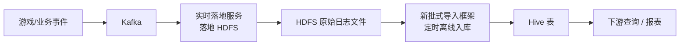

# 数据接入

> 批流一体的数据接入工作：把日志、广告、Kafka、API 等多源数据稳定、可治理地送入数仓。

## 概览

这部分工作围绕一条固定的离线入库链路展开，核心是「先落地、后入库」两段解耦：

- **实时落地服务**：从 Kafka 消费原始日志，可靠地落地成 HDFS 文件——只负责落盘，不做建模。
- **新批式导入框架**：定时读取这些 HDFS 文件，做分解、转换、schema 演进与建表，写入 Hive。

这样把「实时落盘」与「离线建模/治理」解耦：实时侧保证数据不丢、先落地；离线侧保证数据建好模、可查询。广告接入与并发指标采集是这条主链路之外的旁路数据源。

主要项目：

| 项目      | 技术栈              | 职责                             |
| ------- | ---------------- | ------------------------------ |
| 老批式导入框架 | Scala + Spark    | 通用导入 job 框架（老项目，2022 起）        |
| 新批式导入框架 | Scala + Spark    | 配置驱动的批式导入（重构自老框架）              |
| 广告数据接入  | Python + Airflow | 多广告平台数据接入                      |
| 实时落地服务  | Scala + Spark    | Kafka → HDFS 实时落地（新批式导入框架上游）   |
| 并发指标采集器 | Python           | 采集 Prometheus 的 CCU 指标 → Kafka |

## 老批式导入框架

最早的通用导入框架（`common import job`）：按「游戏 + 事件」拆分出一组事件处理器 / 事件提取器（每款游戏、每个埋点事件各一个），负责日志解析、解密、清洗与入库。我最早（2022 起）在这个老项目上工作；当时存在逻辑问题导致离线入库数据常常不可用，项目管理也比较混乱，因此后来参与重构了新批式导入框架。

### 重构的核心：类型转换（canCast）

老框架最核心的一段代码是 `MergeSchema.compatibleType`——它直接抄自 Spark 的 `JsonInferSchema`（源码注释里就写着 "copied from org.apache.spark.sql.execution.datasources.json.JsonInferSchema"），内部调用 `TypeCoercion.findTightestCommonType`。这段逻辑的语义是「找两个类型的最小公共类型」（用于 schema 合并），**而不是**「这份数据能否直接 cast 到目标表 schema」。

问题正出在这里：当源类型是 bigint / double（Long / Double）这类**不能直接 cast** 的类型时，`findTightestCommonType` 给的是一个"理论公共类型"，跟 Hive 表的实际字段类型对不上，最终造成 **Parquet 文件与 Hive 表 schema 不一致，整张表无法查询**。

我负责定位这个问题：彻底重新扫描所有历史 Hive 表与 Parquet 分区、逐个比对出不匹配的 schema，并在老项目里做了大量修数工作。重构时，团队把这段类型转换收敛为 `CastTypeConversion.canCast` 白名单判断——`canSafeCast` + 显式的 Long→Double，不匹配即抛错拒绝，而不是"找公共类型"。

除类型转换这个核心问题外，老框架还有几个结构性问题：

1. **接新事件 = 改代码**：每游戏一个巨大的 `event match` 分支，每加一个事件都要改 switch、写 fix 方法、重新编译部署。
2. **schema 散落在 fix 方法里**：没有显式 schema 演进机制；仓库里还专门有个 `bugfix/` 目录堆满各种一次性修复补丁（修本地日期缺失、修重复数据之类）——数据常常不可用。
3. **配置重复且不一致**：每个游戏各带一份自己的 Config，项目管理混乱。
4. **缺少统一容错**：没有数据比对、坏数据存留、告警等级等机制，数据坏了难发现、难恢复。

### 新框架如何解决

新批式导入框架用「配置驱动 + 声明式组件」一次性解决：

- **配置驱动**：整条 pipeline 由 YAML 描述——`event`、`excluded_event`、`cron_scheduler`、`comparator`、`sink_kafka`、`raw_path`、`generate_airflow` 等；接新事件只加 YAML，不再改 switch。
- **声明式转换器 / 分发器**：转换器声明自己作用于哪些 keyed-dataframe，分发器声明如何切分 batch，可组合复用。
- **显式 schema 演进**：从 JSON 推断 schema 并与 Hive MetaStore 比对，触发「直接写 / 更新表 / 告警」三策略；类型转换收敛到 `canCast` 白名单判断（`canSafeCast` + 显式的 Long→Double），不匹配即拒绝，而非「找公共类型」。
- **内置治理**：数据比对、坏数据存留、告警等级、历史数据恢复、自动生成 Airflow DAG。

## 新批式导入框架

作为对老批式导入框架的重构，把「每游戏/事件硬编码一个 Processor」改为**配置驱动**：定时读取上游实时落地服务落到 HDFS 的 JSON 日志 → 分解/转换 → 写 Parquet → 对接 Hive MetaStore。加一份 config 即可自动生成整条 pipeline + Airflow DAG + 监控，用配置化与 schema 演进解决老框架的数据可用性与治理问题。

功能逻辑：

1. **数据源处理**：读取 HDFS JSON 日志，清洗 `NAN` / `INF` 等非法字符串。
2. **批数据分解**：按配置规则把一个 batch 拆成多个 keyed DataFrame，key 写入文件名与路径。
3. **转换流水线**：每个 keyed DataFrame 走一条 DAG，逐节点按 key 判断是否应用该操作。
4. **Schema 检测与演进**：从 JSON 推断或读配置得到 schema，与 Hive MetaStore 比对，触发「直接写 / 更新表 / 告警」三种策略。
5. **增量导入**：只对新增文件跑 pipeline，追加到已有分区。
6. **坏数据存留**：原始 JSON 统一落 HDFS 路径，便于小文件合并与错误追踪，分区修复后清理。
7. **数据比对**：与另一数据源比对，合并补齐分区保证完整性。
8. **历史数据恢复**：检查 parquet 与表的 schema，修复类型冲突与列歧义。

配套工具：表清理、坏数据修复、schema 比对与修复、一致性校验、Airflow DAG 自动生成等。

## 广告数据接入

多广告平台接入，按平台模块化：TikTok Ads、Google Ads、Google AdMob、Facebook Ads、AppsFlyer Data Locker、SensorTower、Apple Search Ads（历史：Iron Source）。

覆盖的功能点：

- **TikTok**：Smart Plus 广告接入、实体字段扩展、失败报告。
- **Google Ads**：asset performance report、Performance Max 报告、v21 client 适配。
- **Facebook**：历史数据回填、失败配置跳过与账号去重。
- **SensorTower**：API null 指标处理。
- **AppsFlyer Data Locker**：WebHDFS 流式端点迁移。

## 实时落地服务（新批式导入框架的上游）

离线链路的上下游关系是：**Kafka 数据先由实时落地服务落地成 HDFS 文件，再由新批式导入框架定时读取这些文件、处理入库**。这样把「实时落盘」和「离线建表/治理」解耦——实时落地服务只负责可靠地把原始数据落到 HDFS，新批式导入框架负责后续的转换、schema 演进与入 Hive。

其中的时间戳回放补数工具是按时间戳范围回放 Kafka 数据并写入 HDFS，支持 Unix 毫秒、ISO 8601、`yyyy-MM-dd HH:mm:ss` 多种时间格式与 SASL 认证。

## 并发指标采集器

Python 采集器：定时从 Prometheus 采集 CCU（并发用户数）指标，写入 Kafka。按「游戏 + 区域」拆分为多个采集器，并自动生成 Airflow DAG。

## 我的角色

- 老批式导入框架：最早（2022 起）参与的老项目，负责大量修数（数据修复）、schema 不一致排查与新增游戏/事件接入（主要贡献者之一）。
- 新批式导入框架：创始贡献者之一——仓库建立初期即定下配置驱动的框架方向（转换器 / 分发器 / 日志配置接口 + YAML 配置 + schema 演进），并定位了类型转换导致的 schema 不一致问题（扫描历史分区）；此后陆续实现数据比对、坏数据存留、告警、数据修复与 Airflow 集成，并持续接入各数据源。
- 广告数据接入：核心开发者（~160 提交），TikTok / Google / Facebook / SensorTower / AppsFlyer 的接入与功能开发。
- 实时落地服务（新批式导入框架上游）：主要贡献者（~45 提交），含时间戳回放补数工具。
- 并发指标采集器：唯一设计开发者——从 Prometheus 采集 CCU 指标写入 Kafka，含各游戏/区域的采集器与写入器。
