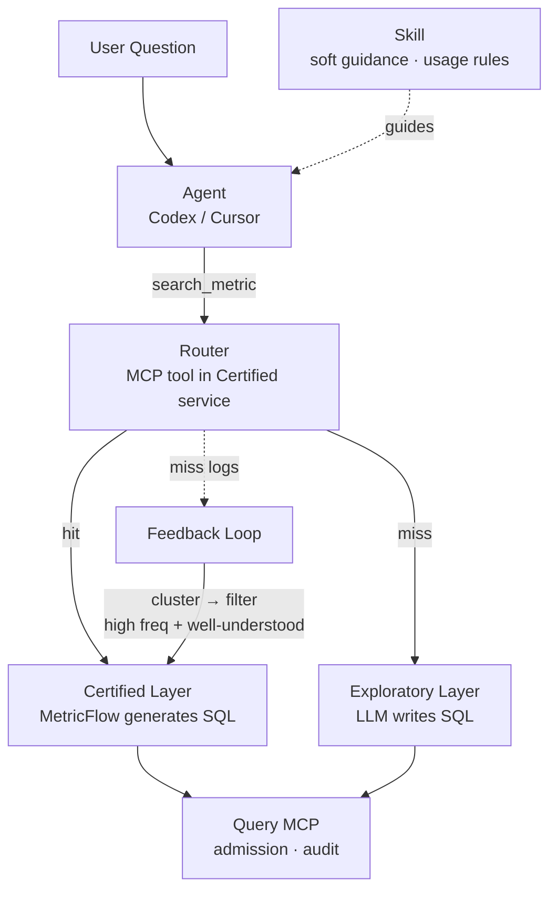

# Semantic Federation：一种组合语义层构建方式

> **Agent Harness 续篇**。前篇《[Agent Harness：如何设计 AI Query 架构](agent-harness-ai-query.zh-CN.md)》讨论了 AI Query 的 Agent Harness 架构（Query MCP + Data Facts Service + 语义层），并把"宽数据域下的语义层怎么建"留作开放问题。本篇续接这一问。

## 1. 引言：两种语义层构建方式

前篇第 7 节讨论了语义层的两种构建方式，各有优劣：

- **自下而上**（semantic docs）：把使用规则、表说明、字段定义、查询边界沉淀成文档，让 Agent 自底向上理解一个数据域。优点是**探索自由度高**、天然覆盖长尾与开放式问题；缺点是**依赖模型能力**、准确性取决于文档质量、文档一多 Agent 就迷失在 doc 海洋里。
- **自上而下**（SQL 模板）：从需求出发，自顶向下定义"这个问题应该怎么查"，Agent 负责选模板、填参数、解释结果。优点是**准确可控**、适合高频口径稳定的场景；缺点是**探索自由度低**、覆盖新问题需要持续维护模板。

两者互补——一个保探索、一个保稳定，答案显然是各取所长。

## 2. 核心概念

- **Semantic Federation（语义联邦）**：分层组织语义的方式——既不是中央集权，也不是各自为政，而是"域自治 + 共享核心"。
- **Certified（认证语义层）**：自上而下构建，收敛跨域一致、高频、口径稳定的核心指标。它是"答案必须对"的那一层。
- **Exploratory（探索语义层）**：自下而上构建，承接各域自有、长尾、探索性的查询。它是"什么都能问"的那一层。

## 3. 架构与实现



### 3.1 路由

问题进来，先由 LLM 拆解成结构化意图（指标候选 + 维度 + 过滤 + 粒度），再基于这个意图做路由，三态分流：

- **命中**（匹配够 + 覆盖完整）→ 认证层，确定性生成 SQL；
- **未命中**（无匹配 / 维度不可达）→ 探索层，LLM 生成式写 SQL；
- **灰区**（匹配中等）→ 注入上下文 / 双轨比对 / 追问。

路由的输入必须是结构化意图，而不是原始问句——原始问句与指标定义之间横着一条语义鸿沟（「帮我看看上个月抖音投的用户第二天还回来多少」与指标库里存的 `R2`），用 embedding 或关键词直接匹配不稳定。只有先由 LLM 把问句拆成「指标候选 + 维度 + 时间」，匹配才落到「结构化指标名 → 指标库」的确定性查找上。

LLM 只负责"拆解"，不负责"判断"：拆出意图后，两个判据依然是确定性的——**匹配度**（用意图里的指标名做精确 key 查找，别名表辅助 LLM 拆解时的口径对齐）；**覆盖度**（把「指标 + 维度 + 粒度」丢给引擎做编译校验，成功 = 覆盖完整，报错 = 不完整）。

例：「各游戏最近 7 天 DAU」拆解出 `dau` + 游戏维度 + 7 天窗口，命中认证层、覆盖完整 → 走认证层；「一个从没定义过的交叉分析」拆解出的指标在认证层查不到 → 走探索层。

**实现形态**：路由是认证层服务里的一个 MCP 工具（`search_metric`），输入是 LLM 拆解后的结构化意图，内部做确定性匹配与引擎编译校验。当指标多到无法全量塞进拆解 prompt 时，先用 embedding 召回 top-k 候选指标喂给 LLM——embedding 在这里只负责缩小候选空间，不负责替 LLM 判断匹配。skill 仍是外层软指导，负责告诉 Agent 何时调用、如何解释结果。

### 3.2 Certified 的实现

认证层建在**维度建模**之上，靠两个工具落地：

- **维度建模**：用 entity（键 / join）、dimension（切片轴）、measure（聚合）三个词，把物理表翻译成结构化、可聚合的业务抽象。这是认证层的"语言"。
- **MetricFlow**：维度建模的"编译器"——把 entity/dimension/measure 的 YAML 定义，确定性编译成 SQL（join 路径、聚合、grain 校验、防 fan-out）。它源自 Transform Data，2023 年被 dbt Labs 收购后成为 dbt Semantic Layer 的引擎，如今以 Apache 2.0 开源。它是确定性编译器，不是第二个 LLM。
- **OSI（Open Semantic Interchange）**：维度建模的"交换协议"——厂商中立格式，让语义定义跨工具可移植（dbt ↔ Snowflake ↔ BI ↔ AI agent）。它由 Snowflake 于 2025 年发起、联合 dbt Labs 与 Salesforce，目标是解决"语义碎片化"（同一个 KPI 在各工具里定义不一致）；2026 年进入 Apache 孵化器，改名 Apache Ossie。

三者关系一句话：**维度建模是语言，MetricFlow 是编译器，OSI 是交换协议。**

一个 MetricFlow 形态的指标定义，例如「收入」进认证层：

```yaml
semantic_models:
  - name: orders
    model: ref('fct_orders')
    entities:
      - {name: order_id, type: primary}
      - {name: customer_id, type: foreign}
    dimensions:
      - {name: order_date, type: time, type_params: {time_granularity: day}}
      - {name: region, type: categorical}
    measures:
      - {name: revenue, agg: sum, expr: amount}

metrics:
  - name: revenue        # 跨域唯一口径，登记进全局 glossary
    type: simple
    type_params: {measure: revenue}
```

### 3.3 Exploratory 的实现

探索层不预定义指标，而是通过两样东西把信息喂给 Agent，让它按需理解、自己写 SQL：

- **Jaina（semantic docs）**：沉淀使用规则、表说明、字段定义、查询边界，作为 skill 让 Agent 自底向上理解一个数据域；
- **Query MCP 的 `table_overview` / `db_overview`**：提供表结构、样例数据与表级事实（owner、分区、新鲜度）。

探索层是软的，安全靠 Query MCP 的 Admission 兜底。

**硬边界不变**：认证层解决「口径一致」，是软指导；安全边界仍在 Query MCP。

## 4. 成本与优势

先说成本，其中「意图提取」最需要解释：把问题拆成"指标 X + 维度 Y + 时间 Z"的结构化意图，需要一次 LLM 调用。但这一步不是路由的额外成本，而是所有路径都绕不开的理解——认证层要靠它喂 MetricFlow 生成 SQL，探索层靠它辅助 LLM 写 SQL。所以它被拆解一次、全路径复用。它真正的难点不在"要不要拆"，而在"拆得准不准"——把模糊的分析意图拆成准确、详尽的指标，本身就是高级模型与高级分析师共同面对的难题，恰恰最该投入强模型，而不是交给轻量模型。拆解这一步决定了后续所有确定性步骤的正确性上限：拆得准，后面的匹配、SQL 生成、执行都是机械的；拆得偏，后面全盘皆错。

**成本三项**：

| 成本   | 说明                          |
| ---- | --------------------------- |
| 意图提取 | 每个问题拆解一次（LLM），产物复用给认证层喂引擎、探索层喂写 SQL |
| 定义维护 | 认证层指标谁来写、review、维护口径        |
| 治理成本 | 共享层维护 + 跨域口径仲裁              |

**优势两个**：

- **核心域查询稳定**：命中认证层的指标，SQL 由引擎确定性生成——口径唯一、可审计、可缓存，几乎不会错。定义对一次，之后所有查询都确定。
- **循环迭代优化认证层**：每一条路由日志都是一次需求探测，未命中 = "这个问题被问了，但认证层答不了"。把这些未命中聚类后，还要过一道筛选——只有**使用频率够高、且口径已经被真正理解（定义清晰、稳定）**的内容，才值得固化进认证层。认证层由此持续生长，而不是照单全收。

## 5. 克制原则

哪些内容该进认证层（OSI），本身不确定，需要按场景调整；各团队之间如何维护认证层，是有挑战的工作——理论上由设计者主导，但必须有明确的更新与维护标准，让其他团队也能用。

过程中最重要的原则是**克制**：

> 不确定的内容，宁可留给探索层模糊构建，也不要盲目引入认证层，导致认证层（OSI）失信。

认证层的权威来自"放进去的每一个指标都是对的"。一旦混入一个口径未定的指标，整个认证层的可信度就被拖累。**认证层宁缺毋滥，探索层宁宽勿窄。**

## 总结

本篇把一个显而易见的 idea——"自上而下与自下而上各取所长"——落成了一个可实施的双层方案：**认证层提供一致，探索层提供覆盖，路由提供衔接，循环迭代提供生长，克制是认证层的生命线。**

回头看这条链路，会发现一件有意思的事：这套方案虽然挂着 Agent 的名，工程实现里的智能需求却趋近于零——除了意图拆解这一端需要模型，匹配、SQL 生成、执行、准入都是确定性的工程。这或许正是 Agent Harness 的本质：把不可控的智能压缩到最小的一点，其余全部工程化、变得可证明、可审计。这也是它区别于"让 LLM 端到端自由发挥"的地方——后者把智能撒满整条链路、处处不可控；前者把它收敛到一端，其余退回确定的工程。

更进一步说，这其实是一个 AI Agent 时代里，数据工程与智能和谐共处的场景：智能负责它擅长却不可控的理解，工程负责它可控且可靠的计算、治理与审计，二者被一条清晰的边界分开。数据工程没有被 AI 取代，反而成了 AI 得以可信落地的地基。

但这仍然是一个**正在探索中的方向，不是已经解决的答案**。我们尤其对三处没有把握：

- **"什么该进认证层"没有客观标准**——跨域、高频、口径稳定，这些判据落地时边界是模糊的，需要按场景反复权衡。
- **联邦治理本质是组织难题**——共享层谁来维护、跨域口径"谁说了算"，是人的问题，技术无法自动化解。
- **克制最难坚持**——它要求主动不做：把不确定的东西留在探索层，哪怕认证层因此显得"没那么全"。而每一次妥协，都在悄悄透支认证层的可信度。

我们更倾向把这些难点讲清楚，而不是把当前的想法包装成最终答案。如果哪一环在真实场景里站不住，欢迎挑战——这正是一套方案该被继续讨论的方式。
